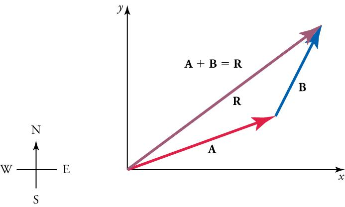

# Week 1 — Days 1 - 7


---

# Day 1 — Sunday , 22 August 2026
# Phase: 0A-Linear Algebra


---

## 📖 What I Studied
``` 
Vectors that what even are they?
watched 3 blue 1 browns video which stated that there are 3 primary views on a vector

watched MIT 18.06SC Linear Algebra Lecture 1: The Geometry of Linear Equations

watched MIT 18.065 The Column Space of Ax contains All Vectors Ax


```


---

## 💡 What I Understood
### From 3 Blue 1 Brown's video, I understood that there are 3 primary views on a vector:

### Physics: Vectors are arrows in space, defined by length and direction 
### Computer Science: Vectors are ordered lists of numbers, useful for modeling data 
#### Mathematics: A generalization that emphasizes the operations of addition and scalar multiplication 

And Also

### Vector Addition:
joining the tail of one vector to the head of another vector, and drawing a new vector from the tail of the first to the head of the second.




### Scalar Multiplication:
Multiplying a vector by a scalar (a real number) changes the length of the vector but not its direction. If the scalar is negative, the direction of the vector is reversed.

### From MIT 18.06 Linear Algebra Lecture 1: The Geometry of Linear Equations:


three key perspectives for understanding the equation 

#### The Row Picture: 
This focuses on viewing each equation individually as a line (in 2D) or a plane (in 3D). The solution is the point where these lines or planes intersect.


This view treats each equation as an individual line (in 2D) or plane (in 3D). You are looking for the exact single point where all these lines or planes cross each other. If you have two equations, you are finding where two lines intersect on a graph.

#### The Column Picture: 
This is highlighted as the most important perspective. It views the system as a linear combination of the columns of matrix 
 to produce the vector 

 This view is about linear combinations. Instead of focusing on lines or planes, you look at the columns of the matrix as separate vectors. The goal is to figure out how much of each column you need to add together (the "combination") to reach your target vector 
. Imagine you are trying to reach a specific destination by taking a certain number of steps in one direction, then a certain number of steps in another direction.
#### The Matrix Form: 
The algebraic way to represent the system using matrix 
, the unknown vector 
, and the right-hand side vector 


### From MIT 18.065 : The Column Space pf Ax contains All Vectors Ax: 

#### Column Space:
 it is All the vectors that can be expressed as a linear combination of the columns of a matrix. In other words the column spoace of A is the set of all possible vectors you can reach by scaling and adding together the columns of A. If you think of each column as a direction you can move in, the column space is like the entire area you can cover by moving in those directions.

 depending on the independence of the columns of A, the column space can be a line, a plane, or even fill up the entire space. If the columns are independent, you can reach more unique points in space. If they are dependent, your movement is restricted to a smaller area.

 #### rank of  matrix:
 The rank of a matrix is defined as the dimension of its column space, which corresponds to the number of independent columns in the matrix

#### Matrix Factorization (A=CR): 
A central theme of the lecture was  the decomposition of a matrix 
 into a matrix  C
 (containing independent columns of 
) and R 
 (containing the combinations needed to reconstruct the original columns)


#### Fundamental Theorem:
 The lecture highlights the proof that the column rank equals the row rank, which is a fundamental theorem in linear algebra. This means that the number of independent columns in a matrix is always equal to the number of independent rows, providing a deep insight into the structure of matrices.


---


## Week 1 Summary:

**Topics covered:**
 

**Biggest thing I learned:**

**Biggest thing still confusing me:**

